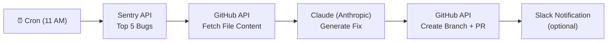

# Bug Solver Bot — Full Implementation Plan

A production-ready Node.js (TypeScript) service that runs daily at **11 AM**, picks the **top 5 unresolved Sentry issues**, asks **Claude** to generate code fixes, then automatically opens **GitHub Pull Requests** for human review.

---

## Architecture Flow



---

## User Review Required

> [!IMPORTANT]
> This bot will create real GitHub Pull Requests against your repository. Set up **branch protection rules** in GitHub (require 1 reviewer) to prevent any auto-merge scenarios — never let the bot push directly to `main`.

> [!WARNING]
> The bot requires 4 API keys/tokens: `ANTHROPIC_API_KEY`, `GITHUB_TOKEN` (with `repo` scope), `SENTRY_AUTH_TOKEN`, and optionally `SLACK_WEBHOOK_URL`. Keep these in `.env` — never commit them.

---

## Proposed Changes

### Project Root

#### [NEW] `package.json`
- TypeScript project files, all deps declared (`@anthropic-ai/sdk`, `octokit`, `node-cron`, `axios`, `dotenv`, `winston`)

#### [NEW] `tsconfig.json`
- Target ES2022, `outDir: dist`, strict mode on

#### [NEW] `.env.example`
- Template with all required env vars and comments

#### [NEW] `.gitignore`
- Standard Node.js ignores

#### [NEW] `Dockerfile`
- Multi-stage build for lean production image

#### [NEW] `docker-compose.yml`
- Local dev: mounts `.env`, runs the service

#### [NEW] `README.md`
- Complete setup + deployment guide

---

### Core Source (`src/`)

#### [NEW] `src/config.ts`
Validates all required env vars at startup — throws with a clear message if anything is missing.

#### [NEW] `src/logger.ts`
Winston logger with timestamps, log levels, and JSON output (structured for production log aggregators).

#### [NEW] `src/sentry.ts`
- `getTopBugs(limit: number)` — calls Sentry Issues API, sorted by `freq`, filtered `is:unresolved`
- Returns parsed array of `SentryIssue` objects (id, title, culprit, stacktrace frames, events count)

#### [NEW] `src/github.ts`
- `getFileContent(path)` — fetches raw file from the repo
- `getRepoStructure()` — lists top-level directories for context
- `createBranch(name)` — creates a new branch off `main`
- `commitFileFix(branch, path, content, message)` — updates/creates a file via the API
- `openPullRequest(branch, title, body)` — opens a PR and returns the URL

#### [NEW] `src/claude.ts`
- `analyzeBugAndFix(issue, fileContent)` → `{ fixedCode: string, explanation: string, filePath: string }`
- System prompt: "You are a Senior Software Engineer. You will be given a Sentry stack trace and the source file. Return ONLY valid JSON with keys: `filePath`, `fixedCode`, `explanation`."
- Uses `claude-3-5-sonnet-latest` model

#### [NEW] `src/agent.ts`
The orchestrator per issue:
1. Parse stack trace to find the top culprit file path
2. Fetch that file from GitHub
3. Send to Claude → get fix
4. Create branch `fix/sentry-{issueId}`
5. Commit fixed file
6. Open PR with Sentry link + Claude explanation in the body
7. (Optional) Post to Slack

#### [NEW] `src/scheduler.ts`
- `node-cron` schedule: `0 11 * * *`
- Calls `runDailyBugFix()` which loops through top 5 bugs
- Includes concurrency control (runs issues sequentially to avoid API rate limits)
- Graceful error handling per issue (one failure doesn't stop the rest)

#### [NEW] `src/index.ts`
- Entry point: validates config, starts scheduler, logs next run time

---

## Verification Plan

### Automated Tests

```bash
# 1. TypeScript compile check (zero errors)
cd c:\Users\sharm\vibhucoding\bug-solver-bot
npx tsc --noEmit

# 2. Dry-run scheduler (fires immediately, skips real API calls)
DRY_RUN=true npx ts-node src/index.ts

# 3. Lint check
npx eslint src/**/*.ts
```

### Manual Verification (with real keys)
1. Copy `.env.example` → `.env` and fill in all 4 tokens
2. Run `npx ts-node src/index.ts` — confirm "Scheduler started, next run at 11:00 AM" log appears
3. Temporarily change cron to `* * * * *` (every minute) to trigger a real run
4. Check your GitHub repo for a new branch `fix/sentry-*` and an open PR
5. Verify the PR body contains a Sentry issue link and Claude's explanation
6. Reset cron back to `0 11 * * *`

### Docker Verification
```bash
docker-compose up --build
# Should see: "Bug Solver Bot started. Waiting for 11:00 AM..."
```
